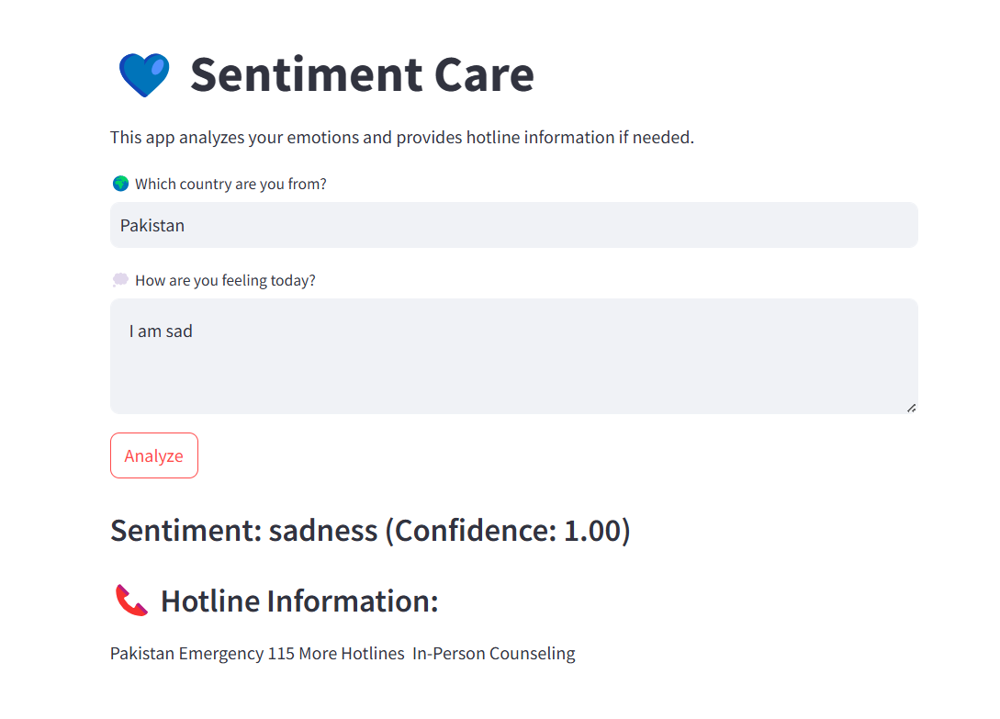

### Sentiment Care

SentimentCare is an AI-powered chatbot built in just one day to analyze user sentiment and provide mental health support. Using advanced sentiment analysis, it detects emotions in user input and offers helpful resources, including mental health hotlines based on the user’s country. Whether you're feeling happy, sad, or anxious, SentimentCare ensures support is just a message away. It’s a safe space to express yourself and get help anytime, anywhere. 💙

[Website Link](https://sentecare.streamlit.app/)

[Entered in Agentic AI Innovation Challenge 2025](https://app.readytensor.ai/publications/sentiment-care-YezPtJJheT35)

# Technical Details

- LLM Used: DistilBERT-based emotion model from Hugging Face

- Framework: Streamlit

- Deployment: Streamlit Cloud

- Environment Management: TOML 

- APIs: Hugging Face Inference API for sentiment analysis

- Web Scraping: BeautifulSoup to fetch mental health hotline information

- Language: Python

